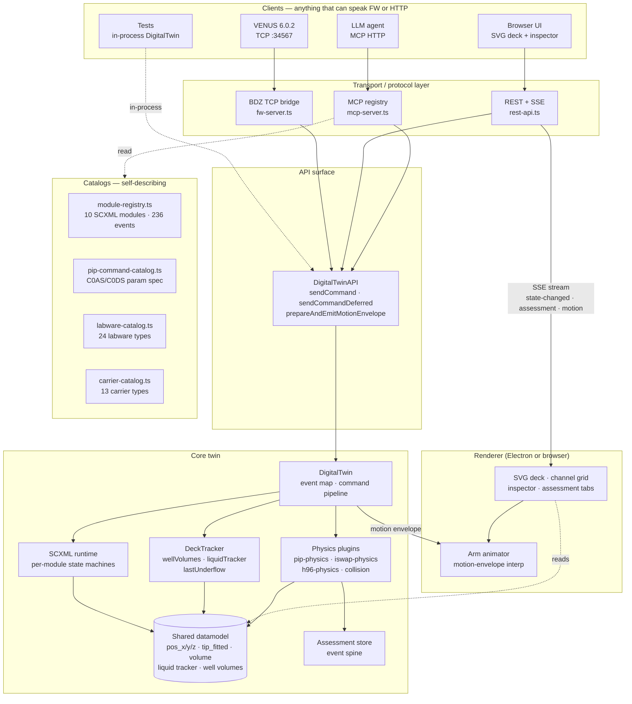
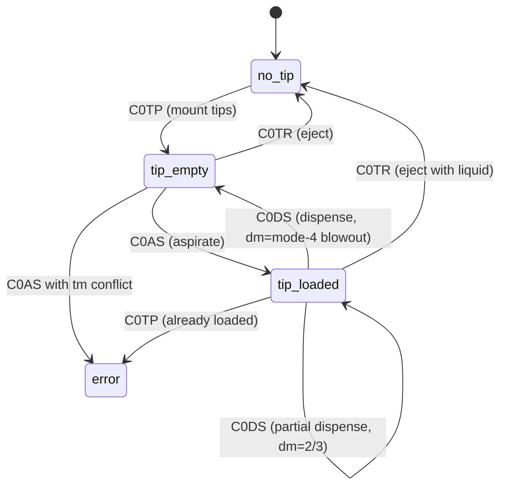
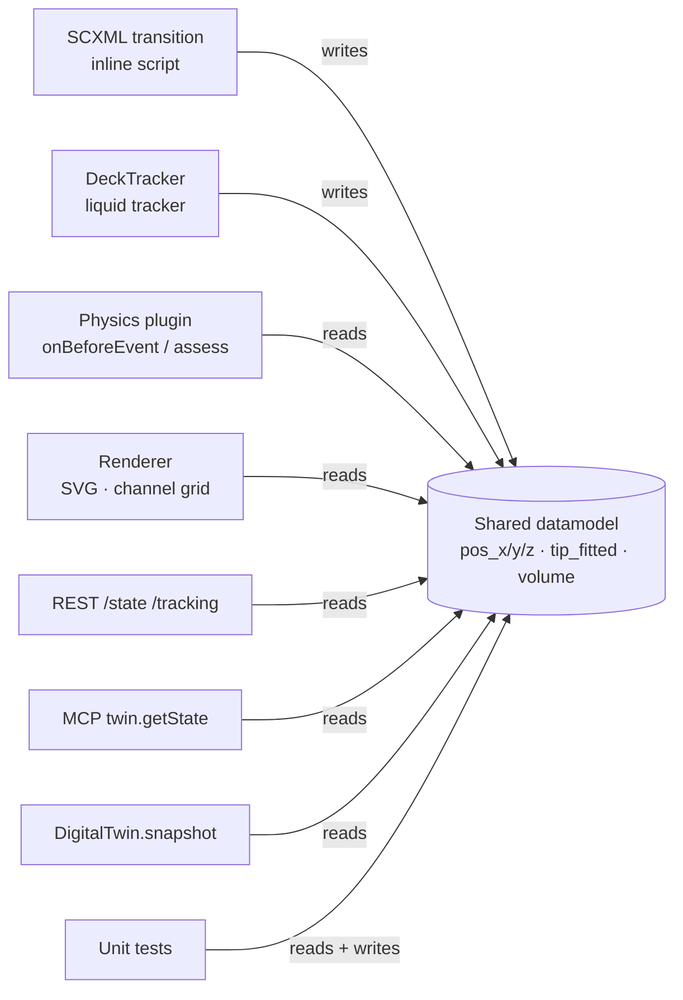
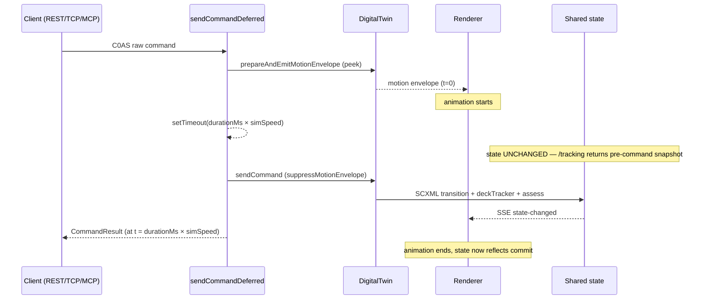
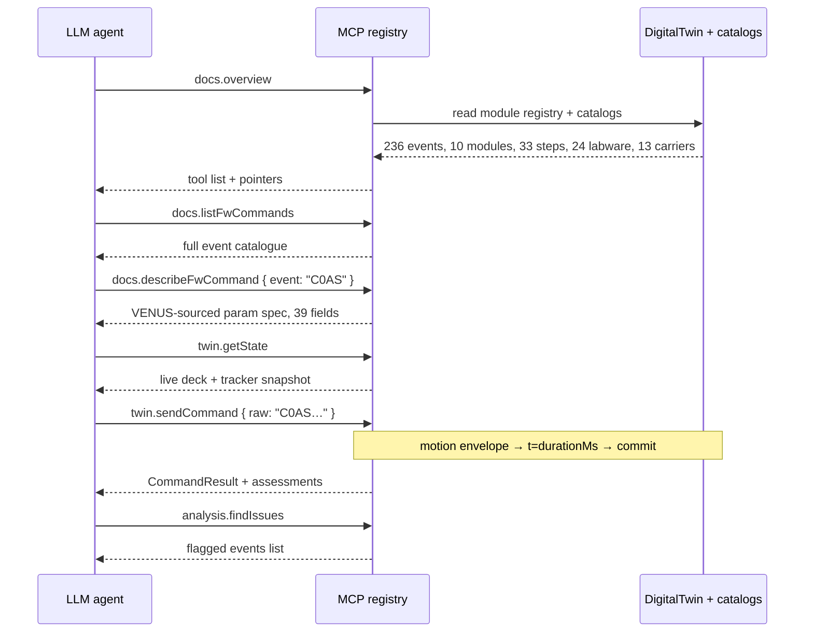
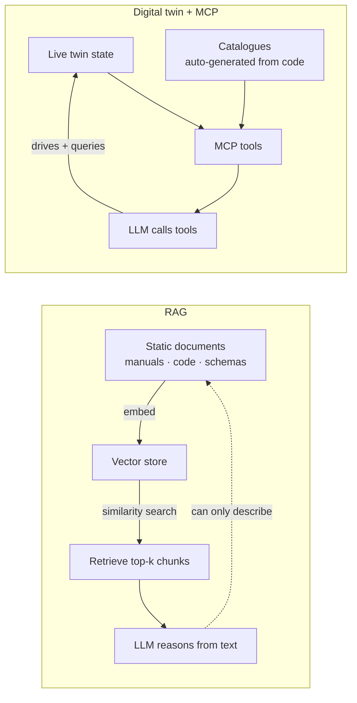

# Hamilton STAR Digital Twin — Architecture

**A firmware-faithful, state-machine-driven digital twin with a shared datamodel between simulation, visualization, and AI-agent introspection.**

> Status snapshot: 2026-04-20 · master @ `snapshot-20260419-2346` · 427 unit tests + 12 fw-integration tests on CI · 236 firmware commands across 10 SCXML modules · 33 high-level step types · VENUS 6.0.2 drives the twin end-to-end.

---

## 1 · Executive summary

The twin is a software instrument. It accepts the **same wire-level firmware commands** the physical Hamilton Microlab STAR does (`C0AS`, `C0TP`, `C0PP`, …), runs them through **W3C-compliant SCXML state machines**, and mutates a **single shared datamodel** that the renderer, physics plugins, HTTP/TCP bridges, and MCP tools all read from directly.

Three architectural decisions set this apart from conventional simulators and from RAG-style "AI has read the manual" approaches:

1. **Firmware is the contract.** The simulation boundary sits at the FW wire protocol, not at the VENUS step layer. VENUS, tests, the TCP bridge, and raw MCP calls all cross the same boundary. One source of truth for what a command does.
2. **SCXML is the logic.** Each hardware module is a declarative state machine. Transitions are data, not code. The machines are authored in VSCXML, compiled to JS, and executed by a W3C-spec runtime. There is no imperative "engine" pretending to be a state machine.
3. **The datamodel is shared.** `pos_x`, `pos_y[i]`, `pos_z[i]`, `tip_fitted[i]`, `volume[i]`, liquid-tracker components, well volumes — all live in one place. The renderer reads them, the physics observes them, the HTTP API snapshots them, the MCP agent queries them. No DTOs, no sync layer, no "UI state" vs "engine state" drift.

Those three decisions plus two supporting ones — **motion envelopes as first-class temporal primitives** and **self-describing MCP discovery tools** — produce a system where the digital version behaves consistently whether it is being driven by VENUS over TCP, by a Playwright browser, by an LLM over MCP, or by a unit test holding a `DigitalTwin` instance in memory.

---

## 2 · The problem

Simulating a liquid-handling robot is usually tackled one of three ways:

| Approach | Where it lives | Why it falls short |
|---|---|---|
| **Protocol-level simulator** | VENUS step layer or higher | Each step is a black box; can't catch firmware-level failures; can't be driven by the real VENUS runtime; the "simulator" and the "real thing" diverge over time. |
| **Full-stack emulator** | C/C++ binary that mimics FW | Heavy, opaque, non-portable; physics is baked into the same code that implements the protocol. |
| **Paper-and-Excel** | Human-written procedures | Doesn't execute; doesn't catch collisions or dead-volume underflow; no feedback loop for LLMs. |

The goal here: **a simulator that speaks firmware, so whatever drives the real instrument also drives the twin** — and everything else (visualization, physics, audits, agent tool-use) derives from that one execution path.

---

## 3 · Layered architecture



The key topology: **every client — VENUS, browser, LLM, test — ultimately exercises the same `DigitalTwin.sendCommand` path**, which in turn is the only place SCXML transitions fire and the datamodel mutates. There is no separate "test simulator" or "UI mock". Tests and production run the same bits.

---

## 4 · Principle 1 · Firmware as the contract

The boundary of the simulation is the **Hamilton C0 firmware protocol** — the same ASCII, line-delimited commands the real instrument's master controller consumes. Commands are strings like:

```
C0ASid0004xp02755yp05300av01000tm01lm0zp01800
    │    │        │        │   │   │    │
    │    │        │        │   │   │    └─ Z target (18 mm)
    │    │        │        │   │   └────── LLD mode
    │    │        │        │   └────────── channel mask (ch1)
    │    │        │        └────────────── volume (100 µL in 0.1 µL)
    │    │        └─────────────────────── Y (530 mm)
    │    └──────────────────────────────── X (275.5 mm)
    └────────────────────────────────────── event id
```

### What this gives us

- **VENUS drives the twin unchanged.** VENUS's runtime opens a TCP connection to the BDZ bridge (`src/services/bdz-bridge/fw-server.ts`), sends firmware commands, and gets back ACKs — bit-for-bit identical to what it would send a real STAR.
- **One execution path for every client.** Browser buttons synthesize FW strings. Protocol steps decompose into FW sequences. The MCP tool `twin.sendCommand` takes a raw FW string. Tests hold a `DigitalTwin` and call `sendCommand` directly. They all hit the same pipeline.
- **Provable fidelity.** `tests/integration/fw-trace-replay.test.ts` replays real VENUS TipPickup com-traces and asserts the twin responds byte-identically.

### The param catalogue

For the PIP family (`C0AS`, `C0DS`) we keep an explicit parameter registry (`src/twin/pip-command-catalog.ts`) pinned to the VENUS `AtsMcAspirate.cpp` / `AtsMcDispense.cpp` source files. Each wire parameter carries:

- wire key (e.g. `av`, `wt`, `po`)
- VENUS field name (`aspirationVolume`, `settlingTime`)
- human description
- scope (per-channel array vs. global)
- wire width
- real-trace example value
- which twin subsystem consumes it (`timing`, `physics`, `state`, `echo-only`)

This registry is what `docs.describeFwCommand` serves to MCP clients.

---

## 5 · Principle 2 · SCXML as the module logic

Each hardware module (10 of them: master, PIP channels, CoRe 96 head, CoRe 384 head, iSWAP, CO-RE gripper, autoload, wash station, temperature, heater-shaker) is a **W3C SCXML state chart**. The charts are authored graphically in VSCXML, checked into `scxml/*.scxml`, and converted to executable JS via `scripts/build-sm.js`.

### Why SCXML is the right abstraction

Hardware modules *are* state machines in the strictest sense:

- A PIP channel is `no_tip → tip_empty → tip_loaded`. It cannot dispense from `tip_empty`; the firmware refuses. A machine encodes that natively with guarded transitions.
- iSWAP is `idle → gripping → holding_plate → moving → releasing → idle`. A misordered command drops into the `error` state and latches until a reset event.
- Master owns the sys-init sequence — 81 commands, many of which are only legal after the appropriate init step.

Writing this in imperative code produces a tangle of `if (state === ... && !flag && !errorPending)` guards. Writing it as SCXML produces a picture that is the program.

### What a transition looks like

Here is the C0AS transition on the PIP channel (compiled form, lightly cleaned):

```js
if (this._matchEvent(event.name, 'C0AS')) {
  // … event routing …
  this._execScript(`
    var av = _event.data.av || 0;
    var total = 0;
    for (var i = 0; i < 16; i++) {
      if (tip_fitted[i]) { volume[i] = av; total += av; }
    }
    active_volume_total = total;
    if (_event.data.xp !== undefined) pos_x = _event.data.xp;
    if (_event.data.yp !== undefined) { /* per-channel Y */ }
    if (_event.data.zp !== undefined) {
      for (var k = 0; k < 16; k++) {
        if (tip_fitted[k]) pos_z[k] = _event.data.zp;
      }
    }
  `);
}
```

That inline script is the **only** place these fields are written for this event. Not a "backing store". Not a mutation method. The datamodel assignments are the transition's effect.

### State-chart snapshot-ability

Because configuration = active state set + datamodel + scheduled timers, the twin can serialize its SCXML state to JSON and restore it elsewhere. `DigitalTwin.snapshot()` + `restore()` are built on this; `analysis.whatIf` uses it to fork alternate timelines from a recorded trace.



---

## 6 · Principle 3 · The shared datamodel

This is the architectural keystone and the biggest single reason the twin stays consistent.

### The typical "simulator" trap

Most simulators layer like this:

```
[ UI state ]  ←  custom sync code  ←  [ engine state ]
                                        ↑
                              [ separate physics state ]
                                        ↑
                              [ tests mock their own state ]
```

Every arrow is a bug. Three independent stores drift. Tests pass against mocks that don't match production.

### What the twin does instead



- One store. `_datamodel` on each SCXML executor + `deckTracker.liquidTracker` + `deckTracker.wellVolumes`. No intermediate DTO.
- One writer per field. SCXML inline scripts are the only place positional state and tip state change. The liquid tracker is the only place well volumes change. No back-doors.
- Every reader looks at the same thing. The deck inspector tooltip, the volume_underflow assessment, the MCP state query, and the snapshot serializer all read the same `wellVolumes.get("PLT_CAR_L5AC_A00_0001:0:0")`.

### Concrete payoff

When the user reports "the well shows 100 µL in the tooltip but I aspirated 200 µL and got no warning", there is one place to look. Not three.

When a test wants to verify "after C0AS the well volume dropped by 300 µL", it reads the same `wellVolumes` map the production UI draws from.

When VENUS sends a C0AS and then polls state, the state it sees is the same state the browser on the developer's monitor is rendering.

---

## 7 · Principle 4 · Motion envelopes as temporal primitives

Real pipetting takes time. A C0AS descends the Z axis, runs the plunger, and retracts — ~2 s for a typical 100 µL aspirate. The twin must represent that time explicitly, not as a cosmetic animation bolted on top of instant state changes.

### The motion envelope

A first-class value emitted by the twin for every motion-producing command:

```ts
interface MotionEnvelope {
  arm: "pip" | "iswap" | "h96" | "h384" | "autoload";
  startX: number; startY: number;
  endX: number;   endY: number;
  startZ?: number; endZ?: number;
  dwellZ?: number;          // For C0AS/C0DS Z-bob: descend → hold → retract
  startRotation?: number; endRotation?: number;
  startGripWidth?: number; endGripWidth?: number;
  startTime: number;        // Date.now() at emit
  durationMs: number;       // Physics-plugin-computed _delay
  command: string;
}
```

Everything temporal is derived from this envelope.

### The state-commits-on-motion-end principle



Key properties:

- The motion envelope is emitted immediately so the renderer starts animating without latency.
- The SCXML transition + deck tracker + assessment + SSE broadcast + HTTP response are all held until the physical duration elapses.
- A consumer polling `GET /tracking` mid-motion sees the pre-command state. No state query returns "future" values.
- `simSpeed = 0` bypasses the delay entirely (tests, fast sims).
- `simSpeed = 1` is real time; `0.5` is 2× faster; `2` is 2× slower — same multiplier convention as the protocol editor dropdown.

This was verified experimentally: for `C0AS av=300 µL` at `simSpeed=1`, polling `/tracking` every 250 ms across a 3-second motion returns the pre-command well volume at every sample; the volume drops at exactly `t=3087 ms`, one poll after the promise resolves.

---

## 8 · Principle 5 · Physics as side-car observers

Physics — contamination, LLD, TADM, collision, foam, dead-volume underflow — are **plugins** that watch the datamodel mutate and emit assessments. They sit alongside the core execution path, never inside it.

### The two-phase contract

Every physics plugin can hook two points on every command:

```ts
interface PhysicsPlugin {
  // Pre-commit: can REJECT (returns errorCode). Used for hard safety
  // invariants: "tip already fitted", "volume exceeds tip capacity",
  // "Z below traverse while X moving".
  validateCommand?(event, data, deckTracker, dm): { valid: boolean; errorCode?: number };

  // Pre-commit: stamps `_delay` (physical duration), computes derived
  // fields (pipTravelTime + aspTime), attaches metadata. Never rejects.
  onBeforeEvent?(event, data): data;

  // Post-commit: OBSERVES the mutation. Never rejects. Emits
  // AssessmentEvents (info / warning / error). Reads wellVolumes,
  // tip contents, contact history, last underflow.
  assess?(event, data, deckTracker): AssessmentEvent[];
}
```

Validation is where the twin refuses. Assessment is where the twin tells you what happened.

### Why the split matters

A real instrument fails hard on some things (tip mask conflict — error 07) and reports soft observations on others (TADM curve looks odd, but the aspirate completed). Conflating them produces simulators that either refuse too much ("too fussy to run real methods") or refuse too little ("method ran but dispensed air into three wells silently").

- `empty_aspiration` — warning, not rejection. Aspirating from an empty well is physically valid; you just draw air.
- `volume_underflow` — warning. Requested 100 µL, got 10 µL liquid + 90 µL air.
- `LLD no liquid detected` — warning. The FW accepts; the assessment flags.
- `contamination` — warning per channel. Aspirating Diluent with a tip still holding Stock residue.
- `collision`, `no_deck_effect`, `air_in_dispense` — each their own severity logic.

All of these ride the same SSE stream, land in the same assessment store, show up in the same UI panel, and are queryable via the same MCP `analysis.findIssues` tool.

---

## 9 · Principle 6 · Self-describing via MCP

The final layer: everything above is exposed as discoverable tools to LLM agents.



There are 28 MCP tools across six namespaces:

| Namespace | Purpose | Example tools |
|---|---|---|
| `twin.*` | Drive the instrument | `sendCommand`, `getState`, `executeStep`, `snapshot`, `restore` |
| `analysis.*` | Navigate recorded traces, what-if | `load`, `jump`, `whatIf`, `inspectWell`, `findIssues`, `summary` |
| `report.*` | Produce reports | `summary`, `well`, `assessmentsCsv`, `timing`, `diff` |
| `deck.*` | Deck layout | `importVenusLayout`, `loadLayout` |
| `venus.*` | VENUS config | `loadConfig` |
| `docs.*` | **Self-description** | `overview`, `listModules`, `listFwCommands`, `describeFwCommand`, `listStepTypes`, `listLabware`, `describeLabware`, `listCarriers`, `describeCarrier` |

An agent's first call is `docs.overview`. It tells the agent what modules exist, how many FW events the twin recognises, what REST endpoints are live, and which other discovery tools to use. The agent then drills down — no pre-loaded manual required.

---

## 10 · Why this outperforms RAG

RAG (retrieval-augmented generation) is the prevailing pattern for giving LLMs domain knowledge: index documents, retrieve by semantic similarity, stuff the retrieved chunks into the prompt.

For an instrument like a Hamilton STAR, RAG falls short in ways that are not subtle.



### Side-by-side

| Concern | RAG | Twin + MCP |
|---|---|---|
| **Source of truth** | Static document corpus. Whatever the author wrote at the time. | The twin itself. Code, catalogues, state are one and the same. |
| **Staleness** | Re-index when documents change. Manual. | Zero — `docs.*` tools return the current code's behaviour. |
| **Schema drift** | The manual says `tm`, the code now uses `_tm_array`. LLM picks the one with higher similarity score. | Code-extracted catalogues. If the field is renamed, the tool's output changes on next call. |
| **Current-state queries** | Impossible. Documents don't know about the running instrument. | `twin.getState` returns live deck contents, tip state, well volumes. |
| **Action capability** | None. The LLM can only write text. | `twin.sendCommand`, `twin.executeStep` — the agent drives the instrument. |
| **Feedback loop** | Open loop. The LLM recommends; nothing verifies the recommendation. | Closed loop. Send command → observe motion envelope → receive assessments → adjust. |
| **Reproducibility** | Non-deterministic retrieval; chunk boundaries leak. | Deterministic: same SCXML + same datamodel → same behaviour. |
| **Audit trail** | Prompt logs only. | Event spine: every command, every transition, every assessment stamped with `correlationId` and `stepId`. Snapshotable. |
| **Hallucination surface** | Large. LLM will confidently cite `C0XZ` if the corpus ever mentioned it. | Small. `docs.listFwCommands` returns the 236 events the twin actually handles. |
| **Scope of "I don't know"** | Silently interpolates. | Explicit: `docs.describeFwCommand` returns `params: null, note: "Detailed parameter catalogue not yet authored for this event"`. |

### The deeper point

RAG treats an instrument like a document. The twin treats an instrument like an instrument. An agent on MCP is not reasoning *about* the STAR from remembered text — it is *talking to* the STAR through a protocol the instrument itself defines and executes.

This is not a minor optimization. A RAG-backed assistant can explain to a user what a C0AS should do. A twin-backed assistant can *run* a C0AS, observe that the well was empty, surface the `empty_aspiration` warning, snapshot the state, fork a what-if where the well had been filled first, and report which branch behaves correctly — all in one turn, with zero hallucination risk because the twin is the ground truth.

---

## 11 · How the twin was built

Six phases, serial execution, each with a hard verification gate. The full plan lives in `docs/PHASE-PLAN.md`; the status dashboard in `docs/PHASE-STATUS.md`. Brief chronology:

| Phase | Theme | Key deliverables | Status |
|---|---|---|---|
| 0 | Test infrastructure | Coverage tooling, audit of every existing test, failure-injection harness. | ✅ `ebd105b` |
| 1 | Serialization + event spine | `DigitalTwin.snapshot`/`restore` (SCXML config + datamodel), self-contained trace recording, unresolved-interaction assessments. | ✅ `d58f0a5` |
| 2 | Service architecture | Split monolithic main into `api/`, `services/`, dual-mode (Electron + headless) runtime. | ✅ |
| 3 | Replay + analysis | State replay (not re-simulation), what-if branching, MCP-accessible analysis tools, spatial event annotation, well inspector. | ✅ |
| 4 | Reports + physics observations | Protocol summary, well reports, assessment CSVs, collision detection, advanced physics (TADM, LLD, foam, meniscus). | ✅ |
| 5 | VENUS protocol bridge | BDZ-over-TCP, FDx handshake, FW-response formatting per real-trace shapes. | ✅ |
| 6 | Real-VENUS robustness | End-to-end VENUS 6.0.2 method runs against the twin; .lay import; .ctr parsing; ghost tool; pan/zoom polish. | ✅ Stages 1-5; residuals listed below. |

Post-Phase-6 polish (April 2026) landed the architectural wins the rest of this document describes: motion-envelope deferred state commit, Z-bar physical-extension semantics, catalog-consolidated single sources of truth, MCP discovery tools.

---

## 12 · What's still missing

These are the meaningful open items. Everything else is triage-level detail.

### From the Phase-6 plan

- **#55 part B — retire Y-axis hardcoded constants.** `Y_FRONT`, `CARRIER_Y_DIM`, `totalTracks` still have fallback values in a few places. The snapshot's `dimensions` already carries platform bounds; the last few readers need to switch over. Visual-regression risk, not blocking.
- **#55 part C — retire `CARRIER_TEMPLATES` / `LABWARE_TEMPLATES` fallbacks, synthesise a default deck from `ML_STAR2.dck`.** The catalogues are now the single source of truth; the remaining embedded template tables should be deleted and replaced with a parsed-on-startup default deck.
- **Detailed FW param catalogue for the non-PIP families.** `C0AS` and `C0DS` are fully catalogued (39 + 36 fields). `C0TP`, `C0TR`, `C0JM`, `C0PP`, `C0PR`, `C0EM`, `C0EN`, `C0CL`, `C0CR`, heater-shaker, etc. — owning-module + event-code only. `docs.describeFwCommand` returns `params: null` with an honest note for these.

### From the larger architecture epics (GH #33-#53)

Most are closed; a few remain partial:

- **#35 collision detection — more scenarios.** The framework is in place; more cross-arm and head-to-deck geometry rules would tighten the coverage.
- **#39 advanced physics — foam/meniscus refinement.** The observables are plumbed; the detection thresholds need empirical calibration against real aspirate traces.
- **#45 VENUS bridge — hardening.** Works end-to-end on VENUS 6.0.2; edge cases around sub-device write-ack formats and non-standard carrier types surface occasionally.

### Not yet in any plan

- **Heater-shaker SCXML completeness.** The module exists (24 events) but a few of the less-common C0 sequences haven't been state-charted yet.
- **384-head C0JW/C0JU/C0JF/JT**. Enumerated in `module-registry.ts`; transitions are thin.
- **FW command registry codegen.** Today the event map and the param catalogue are hand-curated. A codegen pass from the SCXML source files would guarantee they can't drift.
- **Persistent event spine.** Runs in-memory; a persisted store would enable cross-session replay and long-running trace analytics.
- **MCP tool to list step-type param schemas.** `docs.listStepTypes` returns names only; the per-step parameter schemas (what does `easyTransfer` accept?) should be introspectable the same way FW commands are.

None of the above block the value proposition of the architecture. They are fill-out work.

---

## 13 · What this architecture unlocks

Briefly, because this is where slides-from-this-doc will land:

- **Agent-driven lab automation.** An LLM with MCP access can run a complete method, observe assessments, and adapt — on a simulator first, then on real hardware (the same FW boundary works for both).
- **Regression-grade reproducibility.** Every trace is replayable offline. A failed real-instrument run can be snapshot-shared and re-opened anywhere there's a twin.
- **What-if training.** Fork a trace at any command, propose an alternative, diff the physical outcome. Use for method-design teaching, for post-mortems, for pre-flight verification.
- **Zero-ceremony introspection.** Any developer, operator, or agent asks the twin what it can do; the twin answers from the same codepath the execution lives in. No separate doc-site to go stale.
- **Portable physics.** The physics plugins are pure observers over a datamodel. They run identically in Electron, in headless Node, in unit tests, and in CI. The same collision check catches the same bug in all three.

---

## 14 · Appendix — code map

```
hamilton-star-twin/
├── src/
│   ├── twin/                           # Core
│   │   ├── digital-twin.ts             #   Command pipeline, motion envelope
│   │   ├── api.ts                      #   DigitalTwinAPI facade
│   │   ├── deck.ts                     #   Deck geometry + snapshot
│   │   ├── deck-tracker.ts             #   wellVolumes, liquid tracker
│   │   ├── liquid-tracker.ts           #   Components, contamination, airDrawn
│   │   ├── module-registry.ts          #   10 modules · event map
│   │   ├── pip-command-catalog.ts      #   C0AS/C0DS param spec
│   │   ├── labware-catalog.ts          #   24 labware types
│   │   ├── carrier-catalog.ts          #   13 carrier types
│   │   ├── assessment.ts               #   Event store + categories
│   │   └── plugins/
│   │       ├── pip-physics.ts          #   validateCommand + onBeforeEvent + assess
│   │       ├── iswap-physics.ts
│   │       └── h96-physics.ts
│   ├── state-machines/
│   │   ├── scxml-runtime.js            #   W3C SCXML interpreter
│   │   └── modules/*.js                #   10 compiled state charts
│   ├── api/
│   │   ├── rest-api.ts                 #   HTTP + SSE
│   │   ├── mcp-server.ts               #   28 MCP tools
│   │   └── sse-broker.ts
│   ├── services/
│   │   ├── bdz-bridge/fw-server.ts     #   VENUS TCP :34567
│   │   ├── venus-import/               #   .lay .dck .rck .ctr parsers
│   │   └── trace-replay-service.ts
│   └── renderer/
│       ├── deck-svg.ts                 #   SVG deck
│       ├── arm.ts                      #   Motion envelope animator
│       ├── channels.ts                 #   Per-channel Z-bar + volume
│       ├── inspector.ts                #   Well tooltip
│       ├── assessment.ts               #   TADM chart, event list
│       └── layout.ts                   #   Split-pane dividers
└── scxml/*.scxml                       # State chart sources (VSCXML-authored)
```

---

## 15 · Appendix — the primitives at a glance

| Primitive | File | One-sentence description |
|---|---|---|
| `DigitalTwin.sendCommand` | `digital-twin.ts` | The single command pipeline: parse FW string → validate → SCXML transition → deckTracker → assess → result. |
| `DigitalTwin.sendCommandDeferred` | `api.ts` | Emits motion envelope at t=0, commits state at t=durationMs × simSpeed. Used by every live-instrument path. |
| SCXML datamodel | `state-machines/modules/*-s-m.js` | Shared state: `pos_x/y/z`, `tip_fitted`, `volume`, per-module. |
| Motion envelope | `digital-twin.ts:80` | Typed temporal primitive: start/end positions + optional Z-bob + durationMs. |
| Physics plugin contract | `digital-twin.ts:54` | `validateCommand` (reject) + `onBeforeEvent` (enrich) + `assess` (observe). |
| Event spine | `digital-twin.ts` | Linear, correlation-stamped timeline of every command / transition / assessment / deck interaction. |
| MCP registry | `api/mcp-server.ts` | 28 tools across 6 namespaces, self-described by `docs.overview`. |

---

*This document is the source for a slide deck. Each numbered section is one chapter; the Mermaid diagrams are slide-ready once re-rendered in the presentation tool of choice.*
