# Hamilton STAR Digital Twin — Tutorial

A concise, end-to-end walkthrough: start the twin, run a real transfer,
watch every arm move with full X/Y/Z + rotation accuracy, inspect
per-channel TADM, import a VENUS layout, and drive the same flows from
the command line. Every screenshot below was captured from the actual
running UI by `tests/integration/tutorial-screenshots.test.ts` — what
you see is what you get, pinned to the state the test asserts.

> **Light theme.** All images use the built-in light theme — click the
> ☀ / ☾ toggle in the top bar to switch. The dark theme is the default;
> everything described here works identically in both.

---

## 1. Start the twin

```bash
cd hamilton-star-twin
npm install           # first time only
npm run build
npm run start         # opens the Electron UI on port 8222
# or:
node dist/headless/server.js --port 8222   # headless HTTP server, same API
```

Open `http://localhost:8222/` in a browser. With the default layout
pre-loaded and every module initialised, the dashboard looks like this:

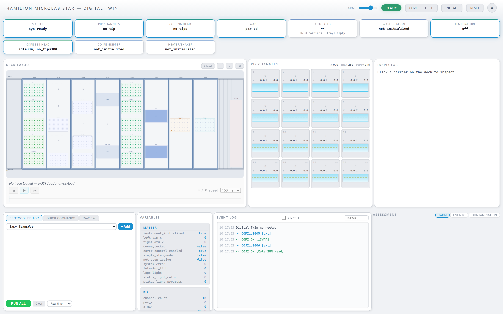

The layout is six panels:

- **Top bar** — live module status (Master, PIP channels, heads, wash,
  temperature). Each chip colour-codes the module's active SCXML state.
- **Deck Layout** (left) — SVG of carriers, labware, and wells.
  Click any well to snap the **ghost head** there.
- **PIP Channels** (centre-top) — per-channel tip state + volume.
- **Inspector** (right) — details of whatever you clicked last.
- **Variables** (centre-bottom left) — live SCXML datamodel dump per
  module.
- **Event Log** (centre-bottom middle) — every FW command, deck event,
  and physics assessment in order.
- **Assessment / TADM** (centre-bottom right) — the **per-channel TADM
  & LLD chart** (see §4 below).

---

## 2. Fill a plate + move tips in one click

Click any well on **SMP001** (sample plate, track 7) to position the
ghost head there. Right-click on the ghost column to bring up the deck
menu:

```
· Fill column 1 (200µL)
· Fill plate (200µL)
· Aspirate 100µL (8ch)
· Aspirate 50µL  (8ch)
· Dispense all   (8ch)
· Dispense 50µL  (8ch)
· Move PIP here
```

Fill the plate to 18 000 × 0.1 µL = 1800 µL (the plate then shows blue
wells instead of empty outlines):

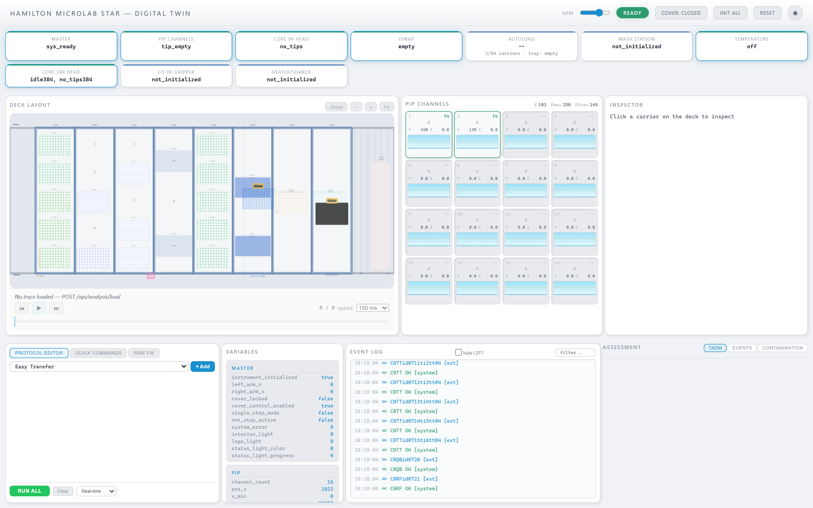

Then click any tip on **TIP001** (leftmost tip carrier) to snap the
ghost to that column:


> **Note on pickup physics.** The twin rejects a tip-pickup whose mask
> asks for a channel that can't reach a tip-rack well (arm
> misalignment → `er22/00`). This matches real Hamilton hardware —
> tip sensors fail, the command errors, and nothing is marked used.
> See `tests/unit/c0tp-mask-validation.test.ts` for exhaustive
> coverage.

Right-click the ghost → *Pick up 8 tips at column 1* → *Aspirate
80 µL (8ch)*. After the aspirate you'll see:

- The `PIP CHANNELS` grid shows all 8 channels loaded as **T4 80uL**.
- The deck log reports `8 tip(s) picked up` + `aspirated 80uL from 8
  well(s) at PLT_CAR_L5MD[SMP001]`.
- The TADM panel lights up with per-channel chips and a `PASS` curve.

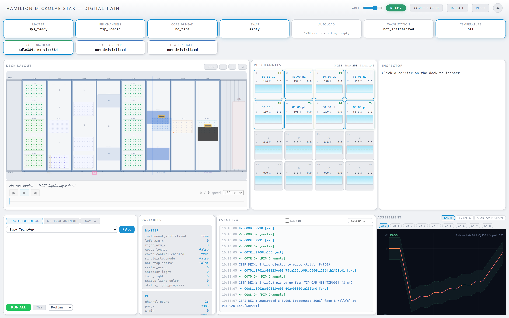

---

## 3. Inspect wells and tips

Click any carrier to show its **Inspector** on the right: well map,
total volume, per-well tip-availability. The inspector re-renders live
as commands execute. Hover any well for a tooltip showing the current
volume and liquid type.

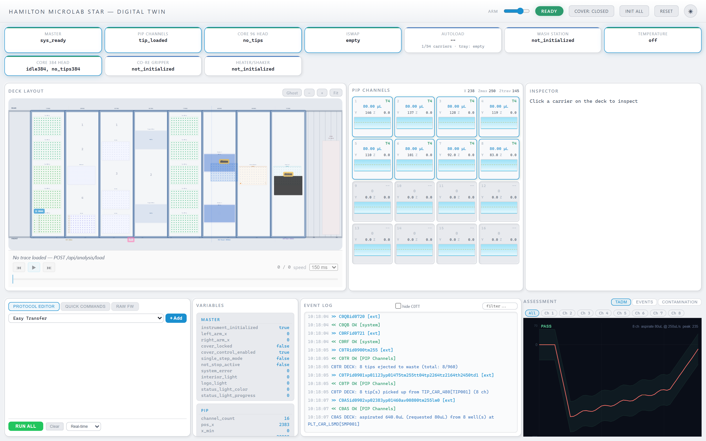

The inspector in the screenshot shows `SMP001 · pos 0 · Cos_96_Rd —
8x12 (96 wells), 96/96 filled, total 144000 uL`.

---

## 4. Per-channel TADM + LLD chart

Switch to the **TADM** tab (bottom-right). Each multi-channel aspirate
or dispense produces one curve **per active channel** — clickable
chips at the top of the chart let you overlay all or isolate any one:


Click a channel chip (e.g. `Ch 3`) to isolate it. The other channel
curves dim to 25% opacity so you can still see their context:


What's on the chart:

- **Coloured curve** — measured pressure over time. Each channel has
  its own hue (matches the chip).
- **Tolerance band** — green (pass) or pink (fail) fill around the
  expected pressure envelope.
- **Violation marker** — orange dot at the sample where a `clot`
  perturbation was detected; pink dot for a general violation.
- **LLD header** — when a single channel is isolated and its LLD data
  is known, the chart shows `surface Z`, `submerge`, and `⚠ crash
  risk` if applicable.
- **Header stats** — `operation volume @ speed peak: <mbar>` — taken
  from the primary channel.

---

## 5. Accurate arm motion — not just X

Every arm renders its full mechanical state, read straight from the
live SCXML datamodel — no hardcoded placeholder coordinates.

### 5.1 iSWAP plate, jaws, and rotation

A plate pickup drives the iSWAP through five axes at once: X (rail),
Y (internal arm extension), Z (grip descent), orientation (landscape
↔ portrait, the `gr` flag on `C0PP`), and gripper width (jaw-to-jaw
distance from the `gb` parameter). Send:

```
C0PPid0101xs05000yj02800zj01800gb01270gr1
```

The SVG overlay draws the real SBS microplate footprint
(127.76 × 85.48 mm = ANSI/SLAS-1-2004) at that position, rotated to
portrait, with the two jaws closed at 127 mm:

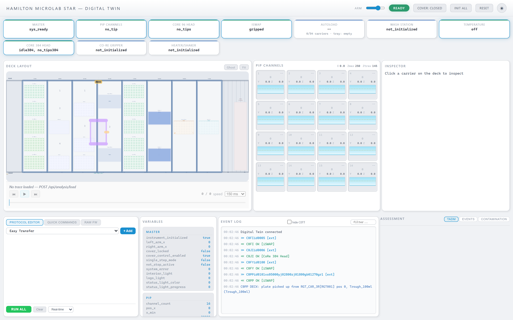

The amber tick at the top of the plate points "north" of the plate —
a quick visual readout for 0° vs 90° orientation. The Z badge below
the arm rail shows `Z 180mm` in amber (engaged) whenever `pos_z > 0`.

### 5.2 CoRe 96-head descent

The 96-head travels in X/Y + Z. Send a move that goes past the safe
traverse height (`zh01200` = 120 mm) down to a deposit height
(`za01800` = 180 mm):

```
C0EMid0200xs08000yh03500za01800zh01200
```

The 8 × 12 dot grid appears on the deck at the head's X/Y, and the
Z badge flips to amber ("engaged — arm below traverse, cannot
translate without hitting labware"):

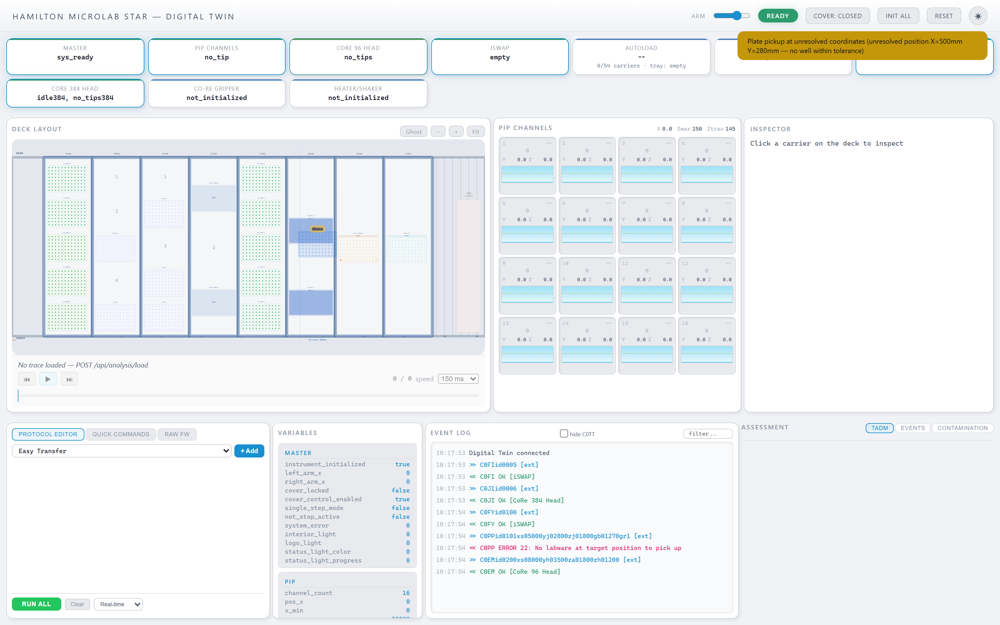

### 5.3 CoRe 384-head X/Y/Z

The 384-head uses its own FW parameter names — `xs` / `yk` / `je` /
`zf` per the real Hamilton `AtsMc384HeadMoveAbs.cpp`. Send:

```
C0ENid0300xs10500yk03000je01700zf01450
```

The 384-head rect (24 columns × 16 rows at 4.5 mm pitch) renders at
the target position with its own Z badge:

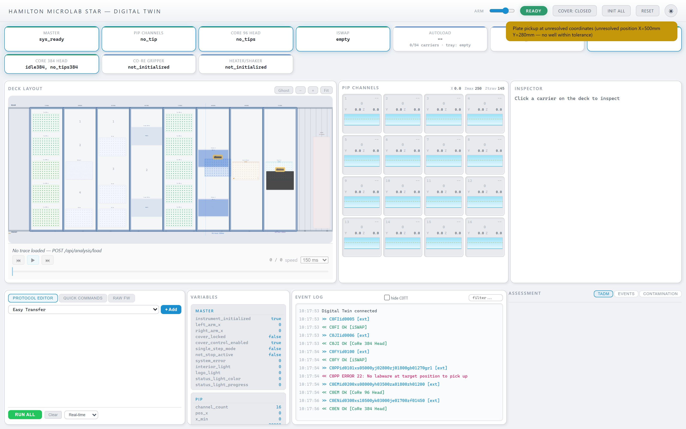

### 5.4 AutoLoad carriage motion

The AutoLoad carriage rides the front rail. `C0CL` (load) with
`pq<track>` targets a specific deck track:

```
C0CLid0400pq18
```

Mid-animation, the carriage slides in X toward the target track. You
can see the motion envelope's trajectory (dashed pink line under the
carriage) — it's emitted the moment the command is accepted, so the
UI knows both where the carriage *is now* and where it's *heading*:

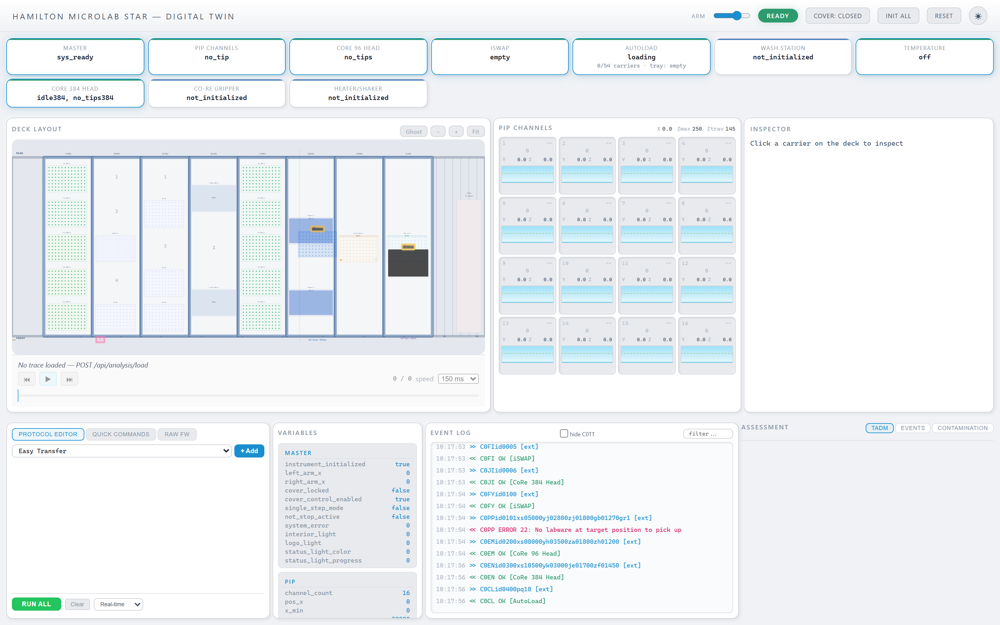

After the `~4.5 s` load time, `carriers_on_deck` increments and
`pos_track` commits — the SCXML's `load.done` delayed event fires
from the `loading` state's `<onentry>` without any external push.

---

## 6. Per-channel X / Y / Z in the PIP panel

A partial pickup that engages only channels 0 and 3 leaves the head
with each of the 16 channels potentially at a different Y and Z (only
masked channels move, per
[this memory](../../memory/feedback_partial_mask_pos_y.md)). The PIP
Channels panel makes that visible:

- **Header**: arm-wide `X` (all channels share the same rail) plus the
  `z_max` / `z_traverse` limits read from the live pip datamodel.
- **Per cell**: tip + volume + liquid type (unchanged from before)
  plus a new `Y` / `Z` numeric readout and a **vertical depth bar**.
- **Depth bar**: fill starts from the top and shrinks as the channel
  descends (less fill = more depth). A dashed amber tick marks
  `z_traverse`; any channel past that tick goes amber — the twin tells
  you exactly which channels are engaged in labware.

Partial pickup + synthetic per-channel Z to make the contrast clear:

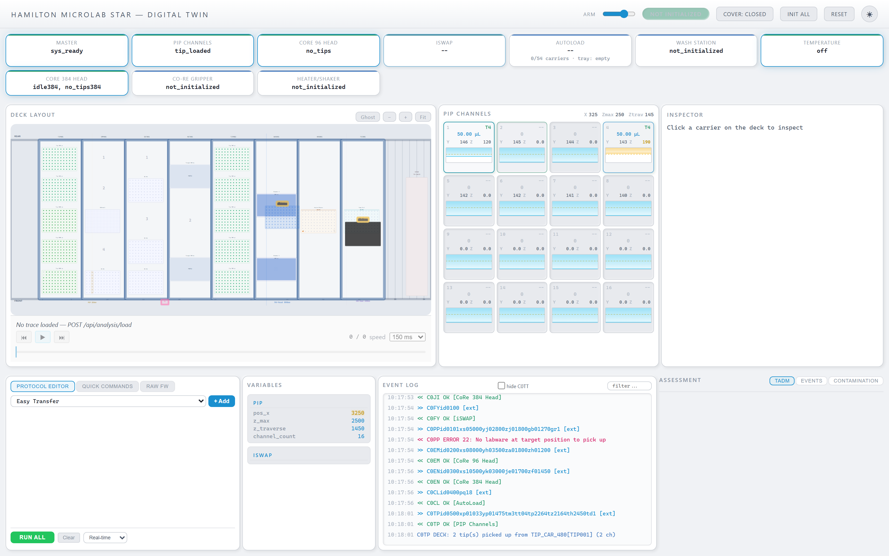

Channel 1 (ch0, z=120 mm) is above traverse — safe to translate.
Channel 4 (ch3, z=190 mm) is below traverse — its cell + bar go amber
so a mistake here is visually obvious before the next FW command.

---

## 7. Event-log filter: hide the C0TT flood

A real VENUS method load fires ~68 `C0TT` tip-type registrations as a
prelude to every method. The `hide C0TT` checkbox next to the Event
Log filter input toggles those entries out of view (both past and
incoming) so you can see the real method exchange:

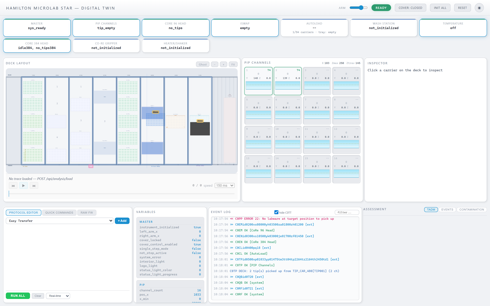

Every log line also carries its 4-character command prefix (e.g.
`<< C0QB OK`) so the filter's regex can match both the `>>` and `<<`
halves of the exchange.

---

## 8. Full deck snapshot

Every arm active simultaneously — iSWAP holding a plate (portrait),
96-head at a deposit Z, 384-head parked at a target, AutoLoad carriage
landed at track 18, PIP arm home:

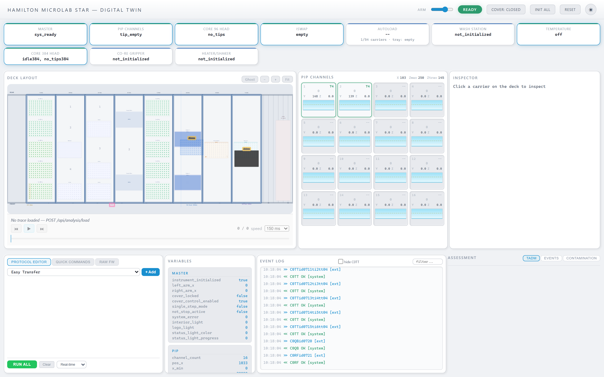

---

## 9. Import a real VENUS layout

The twin parses the four VENUS artefact formats (`.dck` decks, `.tml`
templates, `.rck` racks, and `.lay` method layouts) and rebuilds the
deck from them. Drop in any `.lay` file your lab uses:

```bash
# Using curl (anywhere the twin's HTTP API is reachable)
curl -X POST http://localhost:8222/api/deck/import-lay \
  -H 'Content-Type: application/json' \
  -d '{"path": "/abs/path/to/SN559ILayout.lay", "name": "SN559I"}'
```

Response:

```json
{
  "deviceId": "device_2",
  "metadata": { "deckFile": "ML_STAR2.dck", "activeLayer": "base", "instrument": "ML_STAR" },
  "placements": [
    { "labwareId": "HT_L_0001",  "carrierId": "TIP_CAR_480_A00_0001", "position": 3, "type": "Tips_1000uL" },
    { "labwareId": "ST_L_0001",  "carrierId": "TIP_CAR_480_A00_0001", "position": 2, "type": "Tips_300uL"  },
    { "labwareId": "ST_L_0002",  "carrierId": "TIP_CAR_480_A00_0001", "position": 1, "type": "Tips_300uL"  }
  ],
  "warnings": [
    { "code": "unknown_carrier", "labwareId": "WasteBlock", "message": "unknown carrier file 'ML_STAR\\CORE\\WasteBlock.tml' — skipping placement" }
  ]
}
```

- `placements` tells you exactly which labware went where on which
  carrier — the import is deterministic and traceable.
- `warnings` lists what the registry didn't recognise. Add entries to
  `CARRIER_BY_STEM` / `LABWARE_BY_STEM` in
  `src/services/venus-import/venus-deck-importer.ts` to teach the twin
  a new device.

Same capability via MCP:

```
{ "name": "deck.importVenusLayout", "args": { "path": "/…/SN559ILayout.lay" } }
```

---

## 10. Command-line interaction

Every UI action is also a REST call. A minimal full transfer:

```bash
# 1. Fill a plate
curl -X POST http://localhost:8222/liquid/fill \
  -H 'Content-Type: application/json' \
  -d '{"carrierId":"SMP001","position":0,"liquidType":"water","volume":18000}'

# 2. Pick up 8 tips at TIP001 column 1 (1033, 1475 in 0.1 mm units)
curl -X POST http://localhost:8222/command \
  -H 'Content-Type: application/json' \
  -d '{"raw":"C0TPid0101xp01033yp01475tm255tt04tp2264tz2164th2450td1"}'

# 3. Aspirate 80 µL from SMP001 column 1
curl -X POST http://localhost:8222/command \
  -H 'Content-Type: application/json' \
  -d '{"raw":"C0ASid0102xp02383yp01460av00800tm255lm0"}'

# 4. Check well volumes — column 1 should show 17200 (down from 18000)
curl http://localhost:8222/tracking | jq '.wellVolumes | ."SMP001:0:0"'
```

Key endpoints (full list in `src/api/rest-api.ts`):

| Endpoint | Purpose |
|----------|---------|
| `POST /command`                     | run a raw FW command |
| `POST /step`                        | run a named VENUS step (aspirate, tipPickup, easyTransfer, …) |
| `GET  /state`, `/deck`, `/tracking` | snapshots |
| `POST /liquid/fill`                 | pre-fill a plate |
| `POST /api/deck/import-lay`         | VENUS `.lay` import |
| `POST /api/analysis/load`           | load a recorded `.twintrace.json` |
| `GET  /api/report/{summary,well,assessments,timing,diff}` | trace reports |
| `GET  /api/mcp/list`, `POST /api/mcp/call` | MCP tool bridge |
| `GET  /events`                      | SSE stream (state/tracking/command-result/assessment) |

---

## 11. Test discipline — every screenshot is gated

Every image in this tutorial is produced by a test that asserts the
exact state it depicts. Regressions are caught before docs drift.

```bash
npm run test:unit       # fast — 380+ tests in ~5 s
npm run test:contract   # HTTP round-trips against a fresh server
npx vitest run tests/integration/tutorial-screenshots.test.ts
                        # re-captures every tutorial image
```

Specific guards:

- **Tutorial images themselves**: `tests/integration/tutorial-screenshots.test.ts`
  boots a real twin, drives each workflow with real Hamilton FW
  commands, asserts both the server datamodel *and* the rendered DOM
  (e.g. `.arm-iswap-plate` has `rotate(90)`, `.arm-h96-zbadge` has
  the `arm-z-badge--engaged` class), then writes the PNG. The images
  in `docs/tutorial-images/` are regenerated by this test.
- Ghost-head flow (§2): `tests/integration/ghost-head-e2e.test.ts`.
- Tip-mask fix: `tests/unit/c0tp-mask-validation.test.ts`.
- TADM clot / liquid-follow / air-gap observations:
  `tests/unit/advanced-physics-4c.test.ts`.
- VENUS `.lay` import: `tests/unit/venus-import.test.ts` +
  `tests/contract/deck-import-contract.test.ts`.
- VENUS config auto-adapter (`--venus-cfg`):
  `tests/unit/venus-config.test.ts` — parser, module-bit inference,
  and wire-format encoders for `C0QM` / `C0RM` / `C0RI` / `C0RF` /
  `C0RU` all pinned against real ComTrace values.

---

## 12. Scripted Stage-5 method runs (no VENUS Method Editor clicks)

`tests/helpers/venus-method.ts` exposes `runVenusMethod(backend, method)`
so vitest (or a standalone Node script) can drive Init → Pickup →
Aspirate → Dispense → Eject without touching VENUS's Method Editor.
That unlocks repeatable regression tests for anyone who changes the
twin's `C0TP` / `C0AS` / `C0DS` handling. See `#54` for background.

```ts
import { createTestTwin } from "./tests/helpers/in-process";
import { runVenusMethod, viaInProcess } from "./tests/helpers/venus-method";

const twin = await createTestTwin();
twin.fillPlate("SMP001", 0, "water", 2000);           // 200 µL seed

const result = await runVenusMethod(viaInProcess(twin), {
  initialize: true,
  tipPickup:  { carrier: "TIP001", pos: 0, wellA1: true, channels: 8 },
  aspirate:   { carrier: "SMP001", pos: 0, wellA1: true, volumeUl: 50 },
  dispense:   { carrier: "DST001", pos: 0, wellA1: true, volumeUl: 50 },
  tipEject:   "waste",
});

console.log(result.success);   // true when every FW step was accepted
```

Backends:

- `viaInProcess(twin)` — synchronous, no HTTP hop. What CI uses.
- `viaTwinHttp(baseUrl)` — for tests that boot a real headless twin
  (`createTestServer` + its REST port). The runner POSTs to
  `/command` and `/deck`.
- `viaVenusWebApi(host)` — future: drives a real VENUS 6.0.2 via
  Hamilton's Web API surface. Gated behind `VENUS_HOST`; the stub
  currently throws a clear "not yet implemented" error so adopters
  know to wait.

Integration test: `tests/integration/stage5-real-venus.test.ts`. Gated
to skip on machines without a running twin + asserts the full cycle's
tip / volume / TADM side-effects.

## 13. Where to read next

- `docs/PHASE-STATUS.md` — master index of every phase of the twin's
  evolution.
- `docs/PHASE-6-STATUS.md` — real-VENUS compatibility + the renderer
  UX round (issues #56-#61).
- `docs/PHASE-5-REPORT.md` — VENUS FDx bridge details (the TCP server
  that lets real VENUS address the twin as if it were a physical
  instrument).
- `docs/PHASE-4-REPORT.md` — reports, collision plugin, and advanced
  physics observations.
- `tests/TESTING-GUIDE.md` — assertion discipline. Every new feature
  lands with a failure-injection preamble explaining how the tests
  catch specific regressions.
